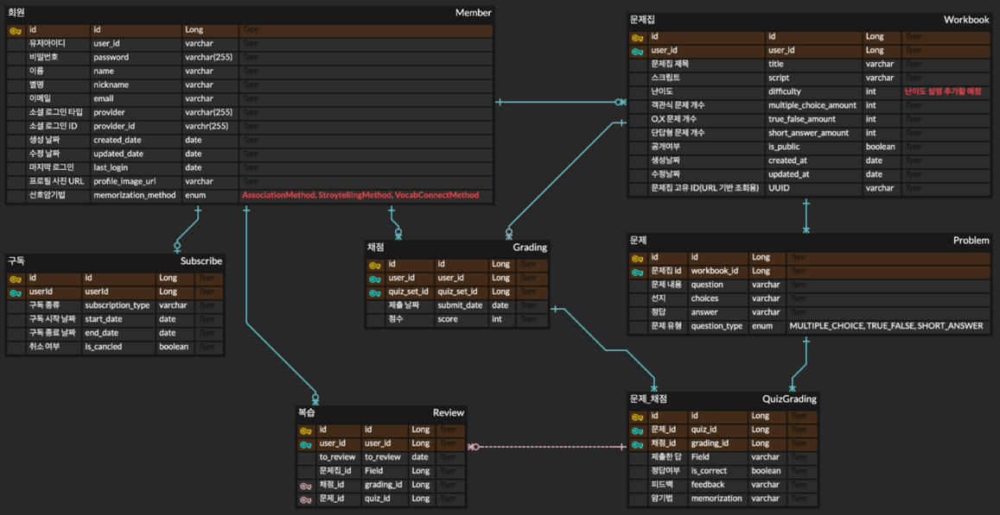

#  Learn & Memorize Intelligence (LAMI)

<h3 align=center>AI 학습 도우미 플랫폼</h3>

 

### 📜 목차 

---

1. [**프로젝트 일정**](#1)
2. [**프로젝트 개요**](#2)
3. [**서비스 소개**](#3)
4. [**주요 기능**](#4)
5. [**기술 스택**](#5)
6. [**산출물**](#6)
7. [**팀원 소개**](#7)
      

### 🗓️ 프로젝트 일정

---

- 일정: 2025년 4월 3일 ~ 6월 12일 (10주)
     

### 🔎 프로젝트 개요

---
많은 사람들이 공부할 때 이해도를 높이거나 확인하기 위해 문제를 풀어보는 방식을 사용합니다. 그러나 실제 대학 교재에는 문제는 있어도 정답이 없거나, 아예 문제가 없는 경우가 많아 효율적인 복습과 학습이 어렵습니다.

이로 인해 관련 문제를 풀기 위해 인터넷에서 자료를 찾아야 하는 번거로운 과정을 거치게 되며, 이는 학습 효율을 저해하는 요인이 됩니다.

저희 팀은 이러한 문제를 해결하고자, 자동 문제 생성과 오답 피드백, 주기적인 복습 리마인드를 통해 반복 학습과 장기 기억을 돕는 AI 학습 플랫폼인 LAMI(Learn & Memorize Intelligence) 프로젝트를 기획하게 되었습니다

또한, 학생뿐 아니라 교사와 강사 등 교육 종사자도 플랫폼을 통해 강의 자료에서 자동으로 문제를 생성하고, 학생들과 공유하며, 학생에게 개인화된 피드백과 암기법을 제공하여 수업 준비와 운영을 더욱 효율적으로 만들 수 있을 것으로 예상됩니다.

  

### 🔎 서비스 소개

---

- PDF/스크립트 기반 문제 생성
- 생성한 문제를 공유하고 풀이 가능
- 자동 채점 및 오답 피드백과 암기법 제공
- 복습 카테고리 추가로 주기적 리마인드 제공

  

### 🔎 주요 기능

---

- **문제집 생성**
  - 사용자가 제공한 PDF/스크립트를 바탕으로 여러 유형의 문제를 생성합니다. 
  - 상, 중, 하 난이도를 지정하여 유연한 문제 생성을 지원합니다.
- **문제집 공유**
  - 사용자가 생성한 문제집을 공유할 수 있습니다. 
  - 문제집 URL 또는 문제집 탐색 탭에서 공유된 문제집을 확인할 수 있습니다.
  - 공유된 문제집은 다른 사용자가 풀어볼 수 있습니다. 
- **문제 풀이 및 채점**
  - 문제를 풀고 채점할 수 있습니다. 
  - 문제 유형에 따라 분류되어 있어 원하는 번호의 문제로 이동을 지원합니다.
  - 제출 시 자동으로 채점됩니다. 
- **피드백 및 암기법 제공**
  - 채점 후 오답에 대해 사용자 성향에 맞는 피드백과 암기법을 제공합니다.
- **복습할 문제를 주기적으로 리마인드**
  - "복습 문제로 추가"로 추가된 문제는 주기적으로 다시 풀어볼 수 있습니다.
  - 사용자는 문제의 이해도에 따라 리마인드 기간을 선택하여 장기적인 암기에 도움을 줍니다.

  

### ⚒️ 기술 스택

---

- **Frontend**

  
  
  
  
  
  

- **Backend**

  
  
  
  
  
- **Infra**

  
  
  

- **Database**

  
  

- **Tool**

  
  
    

### 📜 산출물

---

**아키텍쳐 구조도**

**ERD**

  

### 🖥️ 주요 기능 화면

---

[프론트 엔드 화면들이 작동하는 것을 GIF로 나열하면 좋을 거 같음!]

  

### 팀원 소개

---

<table>
  <tr>
    <td align="center">
       
      <b>김민주</b> 
      <i>Frontend</i>
    </td>
    <td align="center">
       
      <b>채철영</b> 
      <i>Backend</i>
    </td>
    <td align="center">
       
      <b>송민서</b> 
      <i>Backend, Infra</i>
    </td>
    <td align="center">
       
      <b>박준걸</b> 
      <i>Backend, Infra</i>
    </td>
    <td align="center">
       
      <b>채승오</b> 
      <i>Backend</i>
    </td>
  </tr>
</table>
